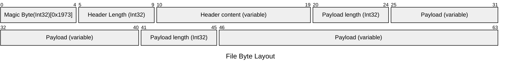

# streaming-proto-file-spike
Platform/language neutral Protocol Buffer based file format specification which is stream writable/readable.

### Problem Statement
Protocol Buffers are [not designed](https://protobuf.dev/programming-guides/techniques/#large-data) for parsing large messages.
### Solution
 This file format specification allows to define custom file formats based on length-prefixed serialized protobuf payloads.

### File Byte Layout
* All integers are 4 byte, Big Endian encoded
* Magic Byte must be constant 0x1973

### Supported Languages
Any language which supports reading/writing files as stream and for which protobuf bindings can be generated.

#### Tested Languages
* Java
* Python