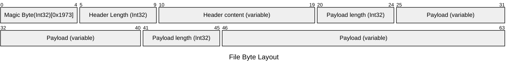

# streaming-proto-file-spike
Platform/language neutral Protocol Buffer based file format specification which is stream writable/readable.

### Problem Statement
Protocol Buffer library is [not designed](https://protobuf.dev/programming-guides/techniques/#large-data) for parsing large messages.

### Solution
 File format specification which allows to define custom file formats based on length-prefixed serialized protobuf payloads. This allows files to be read/written in a streaming fasion, thus not requiring to hold the entire dataset in physical memory of the process.

### File Byte Layout
* All integers are 4 byte, Big Endian encoded
* Magic Byte must be constant 0x1973

### Supported Languages
Any language which supports reading/writing files as stream and for which protobuf bindings can be generated.

#### Tested Languages
* Java
* Python
